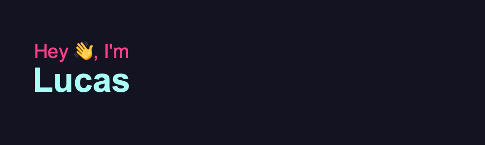

## A Brazilian Software Engineer living in sunny South Florida! ☀️🌴
[](https://www.linkedin.com/in/lucnsousa/)


### I'm a developer with a passion for tech! 💻


```javascript
const lucas = {
    aboutMe: "A developer with a passion for tech who loves to learn about everything!",
    currentInterests: ["Artificial Intelligence", "Fintech"],
    whoIAm: ["Software Engineer", "Full Stack Developer"],
    languages: ["Javascript", "Python", "Java"],
    technologies: {
        frontEnd: ["React", "jQuery", "Bootstrap"],
        backEnd: ["Flask", "Express", "Django", "Spring", "Node"],
        databases: ["MySQL", "NoSQL (MongoDB)", "Mongoose"],
        devOps: ["AWS", "Docker"],
        tools: ["AJAX", "JSON" "Spring Boot", "JSTL", "JavaBeans", "Ubuntu"]
    },
    architecture: ["MVC", "microservices", "Serverless"]
}
```

### Stats
[](https://github.com/LNSousa/github-readme-stats)


<!--
**LNSousa/LNSousa** is a ✨ _special_ ✨ repository because its `README.md` (this file) appears on your GitHub profile.

Here are some ideas to get you started:

- 🔭 I’m currently working on ...
- 🌱 I’m currently learning ...
- 👯 I’m looking to collaborate on ...
- 🤔 I’m looking for help with ...
- 💬 Ask me about ...
- 📫 How to reach me: ...
- 😄 Pronouns: ...
- ⚡ Fun fact: ...
-->
